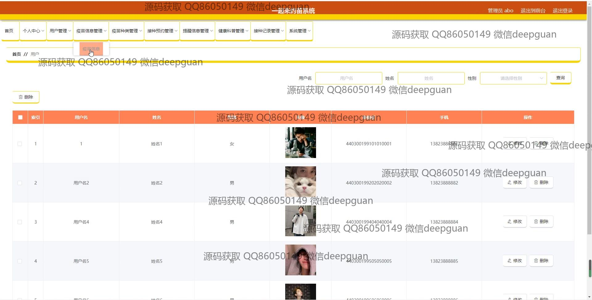
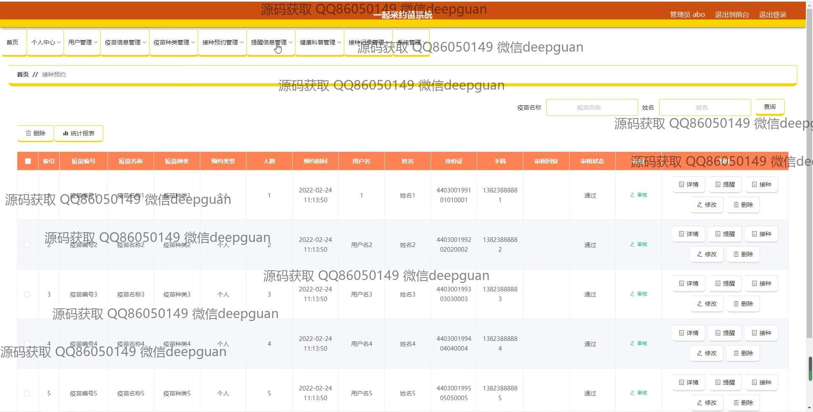

<h1 align="center">一起来约苗系统</h1>

## 简介
一起来约苗系统：基于Spring Boot开发，角色分为管理员和用户；具备疫苗信息管理、接种预约管理、个人中心、健康科普和资讯分享等功能，旨在提供便捷的疫苗预约与信息服务。    --计算机毕业设计源码；毕设源码；java毕业设计源码

## 联系方式

<h3 align="center">获取完整代码与数据库文件 + 微信：deepguan QQ: 86050149 QQ群: 783742310</h3>

<h3 align="center">可帮忙远程部署 包运行成功！提供远程部署、修改代码、设计文档指导、代码讲解等服务！</h3>

## 功能介绍（完整见运行截图）
管理员：登录和退出功能，后台管理包括用户管理、疫苗信息管理、疫苗种类管理、接种预约管理、接种记录管理、系统设置等。提供在导航栏的位置管理首页、疫苗信息、健康科普、疫苗资讯等内容。可以通过数据表格查看和操作疫苗预约信息，包括编辑、删除、提醒和统计分析等功能。

用户：基本功能包括登录、注册和访问个人中心。可以在首页通过导航栏浏览疫苗信息、健康科普和疫苗资讯。支持疫苗预约功能，通过输入预约类型、时间等信息进行预约管理。此外，还有个人信息管理模块，允许用户查看和修改个人信息。

疫苗预约者：可通过系统预约疫苗接种，填写所需的预约信息，如预约类型、时间、姓名、身份证等。支持查看预约记录，并对个人预约信息进行修改和管理。提供交互功能，如在评论区留言和通过咨询服务进行沟通。

内容发布者：通过系统界面管理内容发布，支持文件和视频上传，选择发布时间和使用富文本编辑器编辑内容。可以上传和管理轮播图内容，确保信息的有效展示。

## 运行截图

本代码来源于网络,仅供学习参考使用!

